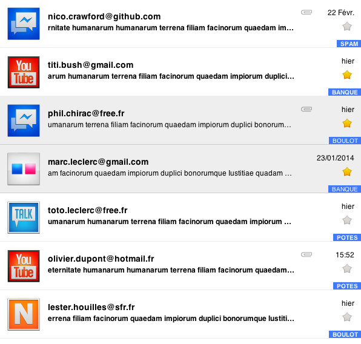

listView tutorial
=================
This tutorial is intended as a first step for Wakanda listView widget. The following subjects are covered:

* **The basics:** how to configure the widget using the studio
* **Adding/editing Templates** How to add your own templates
* **Advanced:** how to write your own template with images and optional elements

## 1. Studio Configuration

The widget can be configured with the following options=

### 1.1 General

* Template: the display that will be used to render the collection (more on templates in the next sections)
* PageSize: the number of items to fetch initially (and at each scroll end)

### 1.2 Template Variables

In this section you map each attribute with a variable name found in the selected template to an attribute of your collection. You may map the same attribute to several variable names.

More on that in the next chapter.

### 1.3 Collection property

The source property is the datasource that will feed data to your list. Each row in your collection, up to *pageSize* will be rendered using the previously set mapping.

## 2. Adding/Editing templates

The templates are defined inside the `templates.js` file. By default, the widget is configured with the following templates:

    {
        list: [
            {
                description: 'listView 1',
                template: '<li><strong>(ID = _({{ID}})</strong>name = {{name}}</li>',
            },
            {
                description: 'listView 2',
                template: '<li>{{ID}}</li>'
            },
            {
                description: 'listView 3',
                template: '<li>{{title}}</li>'
            }
        ],
        defaultData: {
            items: [
                { name: "Leon", ID: "190", logo: "/images/avatar1.png", title: 'title 1' },
                { name: "Marc", ID: "10", logo: "", title: 'title 2' },
                { name: "John", ID: "1", logo: "", title: 'This is John!' }
            ]
        }
    }

The list is an array of objects with two properties:

* **description**: this is the name of the template that will appear in the **1.2**
* **template**: this is an html fragment that follows contains special **variables** that will be replaced with the content of the attributes, as set into the *template variables* property.

### 2.1 Adding a template

To add a new template to your widget, simply add a new entry to the list array.

**NOTE:** when modifying the `templates.js` you *must* **reload** your page.

### 2.1 Editing a template

A template is basically a fragment of html with **special variables** put between two curly braces (*{{var}}*) for each row in the collection, the listview widget will render the html, replacing the variables with the content of the row.

The template follows the [HandleBars][handlebars] template which is a powerful JavaScript template system that's already used in a lot of places, included EmberJS.

Variables are put between two curly braces {{}}. You can use anything with a letter: you cannot use any special character nor space (spaces are reserved for advanced template management).

Example of template:

    {
        description: 'listView 1',
        template: '<li><strong>(ID = _({{ID}})</strong>name = {{name}}</li>',
    }

This template is named "listView1" and jas two variables: *ID* and *name*.

If you had a collection with the following rows:

    {ID: 0, name: 'Mark'}, {ID:1, name: 'John'}

The template would be rendered like this:

    <li><strong>(ID = _(0)</strong>name = Mark</li>
    <li><strong>(ID = _(1)</strong>name = John</li>

## 3. Advanced

The good thing about templates is that they are not limited to variables. What if you wanted:

* conditional elements ?
* to format your variables (eg. date, currency,...) ?

Well, the good news is that HTML templates allows to do that!

In the following example we will learn how to create more complex templates, like the one found in wEmailListApp:

This template could be used in an email app andd has the following features:

* line can be selected depending on variable (attribute) value
* line will display the *attachement* icon only if attachment variable is set to true
* line will use a variable as  source tag
* data will be formatted and not displayed as is, depending on today's date
* rows that have the favorite attribute set to true will have the "star" icon lighted

As you can see, lots of things can be done with templates, and with very little code.

Here is the template:

    <li{{#if isRead}} class="read"{{/if}}>
        <date>{{date}}</date>
        {{#if attachment}}
            
        {{/if}}
        
        <h3>{{email}}</h3>
        <button class="star"></button>
        

            {{text}}
        

        {{tag}}
    </li>

While this sounds a little complicated, let's describe each line:

* The special variable `{{#if variable}}...{{/if}}` allows to include text depending on a boolean value. In the above example, if the class *read* will only be added to the line if the *isRead* variable of the row is set to true.
* The same conditional value is used for the *attachment* attribute
* You may have noticed that the date format is variable: it actually depends on today's date. It will display *hier* (yesterday) if date was yesterday, only the time if it is today, or the full date. To do that, we have simply
defined a hook using the `setHook` method:
    wListView = Widget.create('wListView', undefined, {
        init: function() {
            this.setHook('date', function(dateStr) { return 'the date is: ' + str; })
        }
        });
* The variable can be placed anywhere in the html, including in attribute values: in the above example, the *avatar* variable is used as a source for an image: ``

As you can see, it's quite simple to extend templates to have powerful views.

[handlebars]: http://handlebarsjs.com/ "Visit HandleBars website"
